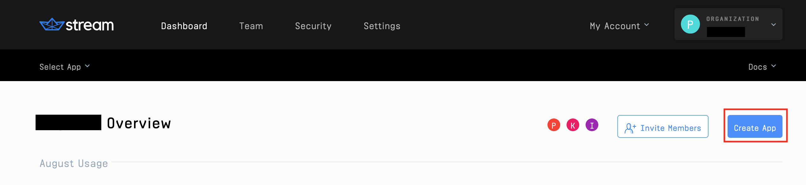

# Create A Support Chat Admin Dashboard

> **In this tutorial, we'll build a chat app with a dashboard that allows an admin user to switch between one-on-one customer chat channels in the same window.**


As a busy customer support representative, you don’t want to be stuck with a chat app that opens each chat in a new window, forcing you to cycle through multiple browser tabs and potentially resulting in losing track of an open ticket. The app we’ll build in this post displays all customer chats in a compact dashboard that bolds new messages as they come in (much like iMessage), and allows support reps to navigate between chats quickly and easily. What's more: this will take a matter of minutes, not hours.

## Requirements

- [node.js](https://docs.npmjs.com/downloading-and-installing-node-js-and-npm)
- [React](https://reactjs.org/docs/getting-started.html)
- A (free) [Stream](https://getstream.io/dashboard/) Trial Account
- Basic knowledge of [React Hooks](https://reactjs.org/docs/hooks-intro.html) and [Express](https://expressjs.com/en/api.html). 

## Background

Stream Chat provides the chat infrastructure for this app, as well as some basic out-of-the-box styling. Topics will be covered using Express JS and React, but the methodologies can be ported to most languages and frameworks.

This post will guide you through the [Git Repository Here](https://github.com/isaidspaghetti/stream-support-dashboard). 

## Stream Configuration

A free Stream Trial account will be needed; [grab yours here](https://getstream.io/). Once you've signed up, create a new app on your [Stream dashboard](https://getstream.io/dashboard/). 

1. Here's the navbar link for the dashboard


2. From the dashboard, create a new app with the 'Create App' button



3. Give your app a name and select 'Development' mode


4. This will generate an API key and Secret which we'll add to a `.env` file in a moment.


### Disable Stream Auth Checks and Permissions

Stream offers Auth Checks and Permissions Checks by default. These will be useful for any production environment, but we'll disable them for this case. Here's how:

1.  In your Stream dashboard, select your app. Click the 'CHAT' navbar dropdown and select 'Overview'


2. Scroll down and activate the 'Disable Auth Checks' and 'Disable Permissions Checks' toggles.


### `.env` Configuration

The [Git Repo](https://github.com/isaidspaghetti/stream-support-dashboard) contains a file in `backend` titled `.env.example`. Add your Stream API Key and Stream Secret here, then rename the file to `.env`. 

```bash
// backend/.env.example:1
NODE_ENV=development
PORT=8080

STREAM_API_KEY= your Stream API key here
STREAM_API_SECRET= your Stream API secret here
```

## Spin 'Er Up

Your app should now be ready to run. The app is split into a `frontend` folder created using `stream-chat-react` and a `backend` folder created using `npm express-generator`.

To start the app on your machine run `npm install` and `npm run start` on both the `frontend` and `backend` folder. Once running, navigate to `http://localhost:3000` to see the `frontend`. Now, we can dive into how this app works.

## Router

The frontend is split between an `Admin` component and `Customer` component. Each has their own login page and chat window. Here's the `Router` to distinguish the two.

<!-- https://gist.github.com/isaidspaghetti/3fd430fe48217164c96ebc48c4b483c9 -->
```jsx
// frontend/src/index.js:9
ReactDOM.render(
  <React.StrictMode>
    <BrowserRouter>
      <Switch>
        <Route path="/" exact={true}>
          <Customer />
        </Route>
        <Route path="/admin" exact={true}>
          <Admin />
        </Route>
      </Switch>
    </BrowserRouter>
  </React.StrictMode>,
  document.getElementById('root')
);
```

To view the customer login, navigate to `localhost:3000/`. To view the admin login, go to `localhost:3000/admin`.

## Customer Login (Frontend)

Let's investigate the login portion of the `Customer` component.

<!-- https://gist.github.com/isaidspaghetti/8cb7426cf54f3f03b4b591072fb815f5 -->
```html
// frontend/src/Customer.js:105
return (
  <div className="App container">
    <form className="card" onSubmit={register}>
      <label>First Name</label>
      <input
        type="text"
        value={firstName}
        onChange={(e) => setFirstName(e.target.value)}
        placeholder="first name"
        required
      />
      <label>Last Name</label>
      <input
        type="text"
        value={lastName}
        onChange={(e) => setLastName(e.target.value)}
        placeholder="last name"
        required
      />
      <label>Email</label>
      <input
        type="email"
        value={email}
        onChange={(e) => setEmail(e.target.value)}
        placeholder="email"
        required
      />
      <button type="submit">
        Start chat
      </button>
    </form>
  </div>
);
```

The snippet above returns the following:


This simple login form takes in `firstName`, `lastName`, and `email`. These are state variables that will be sent to the backend in the `register` function. Let's peek at the first half of the register function, the `POST` to the backend

<!-- https://gist.github.com/isaidspaghetti/a024a228c31201c771974142b5177e43 -->
```jsx
// frontend/src/Customer.js:29
e.preventDefault();
const response = await fetch('http://localhost:8080/customer-login', {
  method: 'POST',
  headers: {
    'Accept': 'application/json',
    'Content-Type': 'application/json',
  },
  body: JSON.stringify({
    firstName,
    lastName,
    email,
  }),
});
```

I chose to write this request without any libraries, to clearly show what is being transmitted. I recommend the [axios](https://github.com/axios/axios) library if you're looking to simplify.

Next, let's see how the backend and how it handles the registration.

## Customer Login (Backend)

First, the backend must establish its validity with Stream by configuring a `serverSideClient`, which is authenticated with your unique Stream API Key and Secret. 

<!-- https://gist.github.com/isaidspaghetti/6a8c13301fdf6f6b395af2696c8c4d97 -->
```javaScript
// backend/routes/api.js:5
const streamApiKey = process.env.STREAM_API_KEY;
const streamApiSecret = process.env.STREAM_API_SECRET;
const serverSideClient = new StreamChat(streamApiKey, streamApiSecret);
```

Next, the `/customer-login` endpoint accepts the customer inputs and registers a chat. Here's the process flow:
* Normalize customer input from frontend
* Generate a token for the customer
* Open a chat channel
* Add members to the channel
* Return this data to the frontend

Note how the Stream library is the workhorse for this process, offering methods like `.createToken`, `.updateUser`, `.channel`, and `.addMembers`.

<!-- https://gist.github.com/isaidspaghetti/d901443830ef67a71810ec3876639bdf -->
```jsx
// backend/routes/index.js:10
router.post('/customer-login', async (req, res) => {
  try {
    const firstName = req.body.firstName.replace(/\s/g, '_');
    const lastName = req.body.lastName.replace(/\s/g, '_');
    const username = `${firstName}${lastName}`.toLowerCase();

    const customerToken = serverSideClient.createToken(username);
    await serverSideClient.updateUser(
      {
        id: username,
        name: firstName
      },
      customerToken
    );

    const channel = serverSideClient.channel('messaging', username, {
      name: `Chat with ${username}`,
      created_by: { id: 'admin' },
      members: [username, 'admin']
    });

    await channel.create();
    await channel.addMembers([username, 'admin']);

    res.status(200).json({
      customerId: username,
      channelId: username,
      customerToken,
      streamApiKey,
    });

  } catch (err) {
    console.error(err);
    res.status(500).json({ error: err.message });
  }
});
```

Some useful notes on the Stream methods used above:
* `.createToken` takes in the username for the argument and generates a unique token for each participant in a chat.
* `.updateUser` takes in an object, wherein the user `id` must be sent, and a `name` can be applied. The method requires a token for the user.
* `.channel` accepts ( *channel-type*, *channel-id*, *options-object*). By specifying an array of  `members`, we restrict channel access to those with the user id's specified.

Next, we'll check out how the frontend receives the backend response. 

## Chat Initialization (Frontend)

Let's explore the second half of the frontend `registration` function in `Customer.js`:

<!-- https://gist.github.com/isaidspaghetti/828c1aabb6e6365480e98b8d70721bc2 -->
```jsx
// frontend/src/Customer.js:43
try {
  //...

  const { customerId, customerToken, channelId, streamApiKey } = await response.json();
  chatClient = new StreamChat(streamApiKey);

  await chatClient.setUser(
    {
      id: customerId,
      name: firstName,
    },
    customerToken,
  );

  const channel = chatClient.channel('messaging', channelId, {
    name: `Chat with ${customerId}`
  });

  await channel.watch;
  setChannel(channel);

} catch (e) {
  console.error(e, e.error);
}
```

The backend's response is destructured. The following steps mirror the chat setup from the backend: 
* Set the user
* Configure the channel for the frontend to join
* Watch the channel, so that the user's browser receives all events occurring in the channel
* `setChannel(channel)` is called so we can use the channel state later in rendering the chat

## Render Customer Chat

Now that the `channel` is established, the customer chat is returned with the following block of code:

<!-- https://gist.github.com/isaidspaghetti/df91e8741a82e9bb890f1063b8252f38 -->
```html
// frontend/src/Customer.js:66
if (channel) {
  return (
    <Chat client={chatClient} theme="commerce light">
      <Channel channel={channel}>
        <Window>
          <div className="stream-header">
            <div className="str-header-left">
              <p className="stream-header-left-title">
                Customer Support Chat
              </p>
            </div>
            <div className="str-chat__header-livestream-right">
              Second National Bank
            </div>
          </div>
          <MessageList
            typingIndicator={TypingIndicator}
            Message={MessageCommerce}
          />
          <MessageInput Input={MessageInputFlat} focus />
        </Window>
      </Channel>
    </Chat>
  );
} else {
  // ...
}
```

Here, again, Stream provides all the components we need to build the chat. The header is an optional inclusion, but it gives us a chance to play around with some of the built-in data Stream offers.


> ⭐️Good to know: Stream offers loads of convenient channel data we can use anywhere in our apps. We can replace the `Second National Bank` header with something like: `Welcome, {client.user.name}`, to render: 

> 


The `<Chat />` component has several handsome out-of-the-box themes. For this instance, we'll use `commerce light`. [Here's a list](https://getstream.github.io/stream-chat-react/) of the available themes. 

The channel we just created is specified in the `<Channel />` component. The `<MessageList />` and `<MessageInput />` an also be easily [customized](https://getstream.github.io/stream-chat-react/#messagelist).  That's all we need for the customer side; let's check out the `Admin` component.

## Admin Login

The Admin Login page mimics the same steps as for the customer, but only accepts an `Admin Id` in the form input. Here's the form: 

<!-- https://gist.github.com/isaidspaghetti/ddaf6d173617e77308659d3df6ab5827 -->
```jsx
// frontend/src/Admin.js:81
return (
  <div className="App container">
    <form className="card" onSubmit={register}>
      <label>Admin Id</label>
      <input
        type="text"
        value={adminId}
        onChange={(e) => setAdminId(e.target.value)}
        placeholder="Enter your admin ID"
        required
      />
      <button type="submit">
        Start chat
      </button>
    </form>
  </div>
);
```

And here's the registration function, which only `POST`'s an `adminId`, but follows the same channel setup. 

<!-- https://gist.github.com/isaidspaghetti/7595ae74d05153bdedac77883444c920 -->
```jsx
// frontend/src/Admin.js:23
const register = async (e) => {
  try {
    e.preventDefault();
    const response = await fetch('http://localhost:8080/admin-login', {
      method: 'POST',
      headers: {
        'Accept': 'application/json',
        'Content-Type': 'application/json',
      },
      body: JSON.stringify({
        adminId,
      }),
    });

    const { adminToken, streamApiKey, adminName } = await response.json();
    chatClient = new StreamChat(streamApiKey);

    await chatClient.setUser(
      {
        id: adminName,
        name: 'Administrator'
      },
      adminToken,
    );

    const channel = chatClient.channel('messaging', 'livechat');

    await channel.watch();
    setChannel(channel);

  } catch (e) {
    console.error(e);
  }
};
```

This is nearly identical to the `/customer-login` endpoint. It creates a token, initializes the client, sets a user, and opens a generic channel. As new customers start chats, the channel list will be automatically populated.

## Render Admin Dashboard

Here's how the Admin Dashboard looks: 


The main difference between the customer and admin registration is in the rendered Stream components. 

<!-- https://gist.github.com/isaidspaghetti/c55cd6cf9167f4463ad04a2df677091e -->
```html
// frontend/src/Admin.js:59
return (
  <Chat client={chatClient} theme={"messaging light"}>
    <ChannelList
      sort={{ last_message_at: -1 }}
      Preview={ChannelPreviewMessenger}
      onSelect={(channel) => { setChannel(channel); }}
    />
    <Channel>
      <Window>
        <ChannelHeader />
        <MessageList />
        <MessageInput focus />
      </Window>
      <Thread />
    </Channel>
  </Chat >
);
```

Notice the `<ChannelList />` component. This is another Stream built-in that handles the side pane with all channels hosted by our app. Stream's API will keep a history for each channel. The `ChannelList` component comes with loads of listeners to update the view when new chats are started, messages are sent, etc.

The `sort` option will show the chat with the most recent message at the top of the list. The `Preview ` shows a snippet of the most recent message. The `onSelect` uses the `setChannel` state method to show the selected channel. 

## Review

There you have it! A fully functional chat app with a powerful admin dashboard. Hopefully this tutorial provides some extra insight into working with Stream. Check out the [Stream Chat Docs](https://getstream.io/chat/docs/?language=js) and [Stream Chat React Docs](https://getstream.github.io/stream-chat-react/) for more inspiration and guidance for your projects. 